# Capture Hasil Praktikum

## Praktikum 1: Membuat Project Flutter Baru
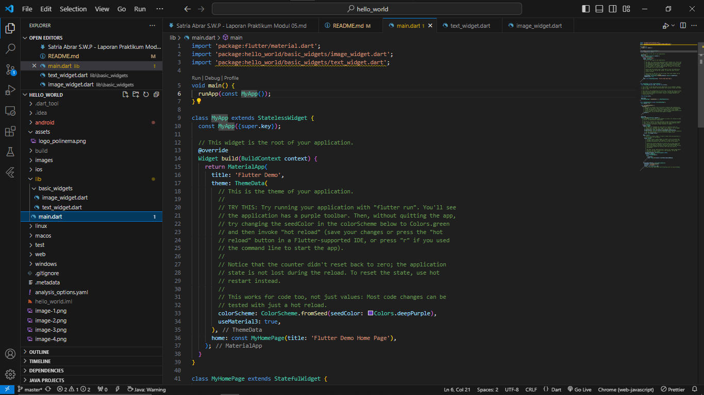

## Praktikum 2: Menghubungkan Perangkat Android atau Emulator
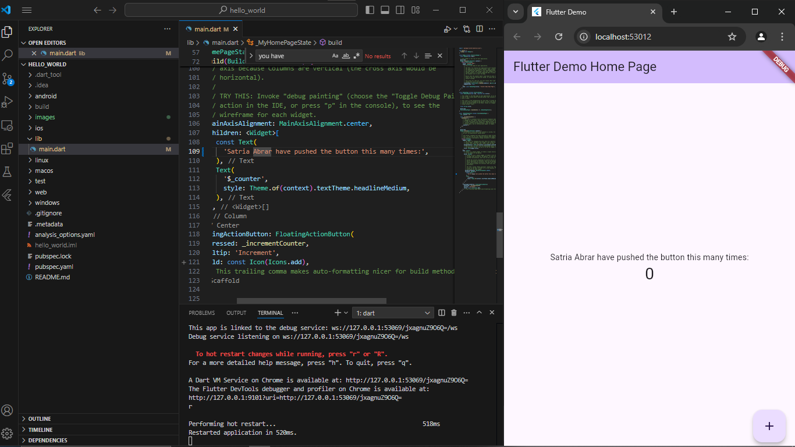

## Praktikum 3: Membuat Repository GitHub dan Laporan Praktikum
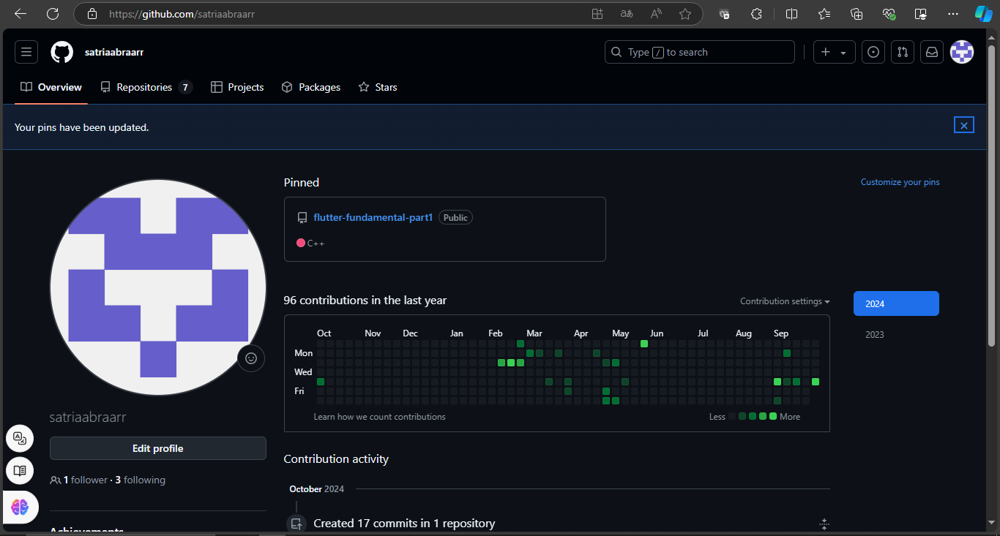

## Praktikum 4: Menerapkan Widget Dasar

### Text Widget
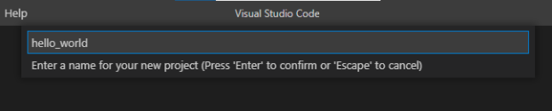

### Image Widget
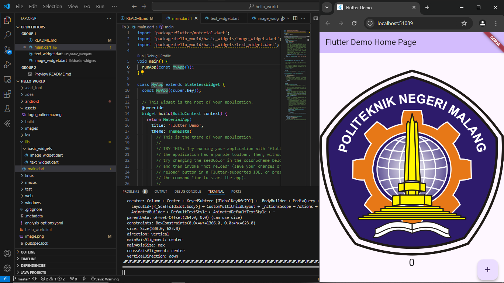

## Praktikum 5: Menerapkan Widget Material Design dan iOS Cupertino

### Cupertino Button dan Loading Bar
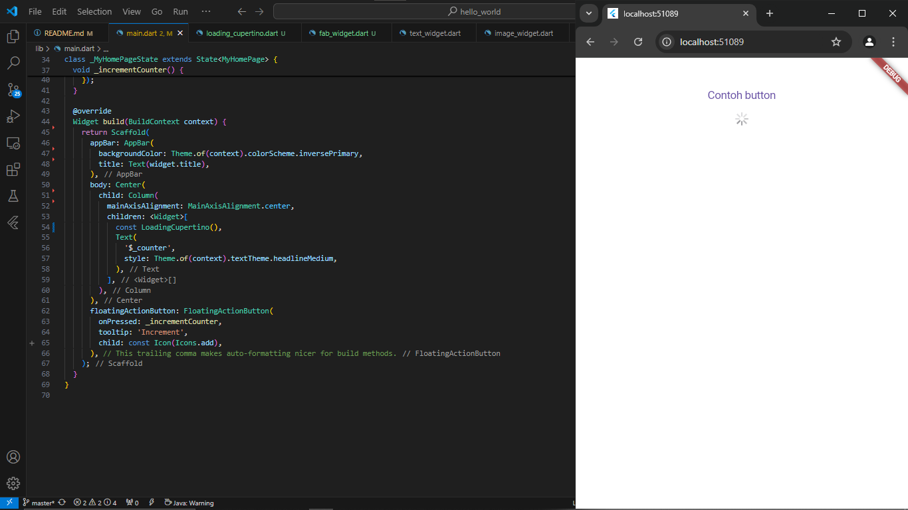

### Floating Action Button (FAB)
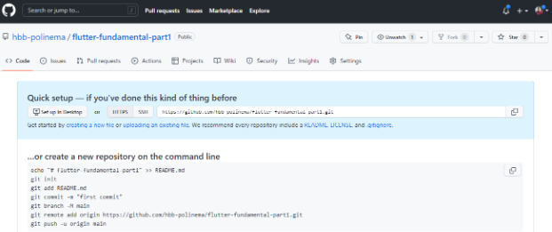

### Scaffold Widget
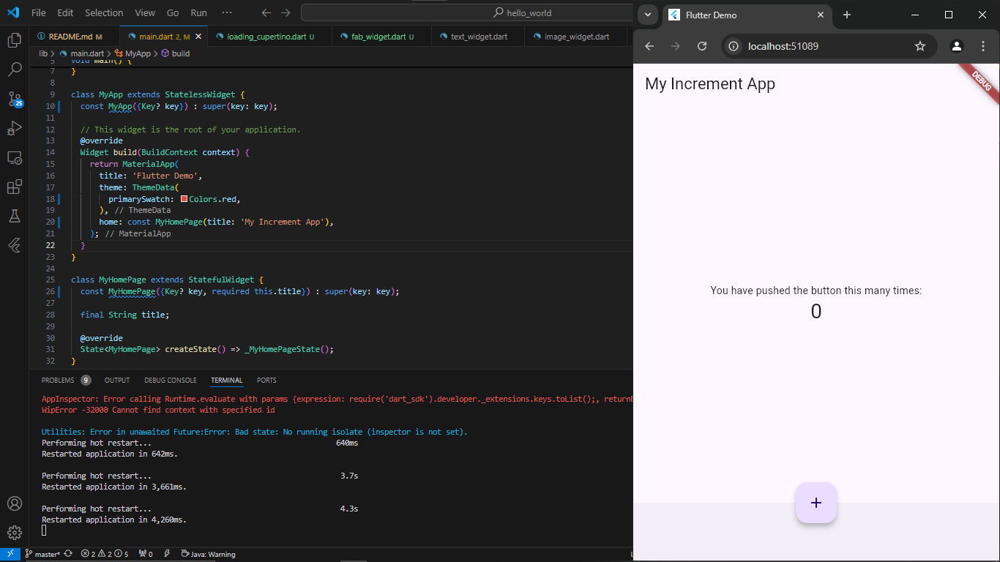

### Dialog Widget
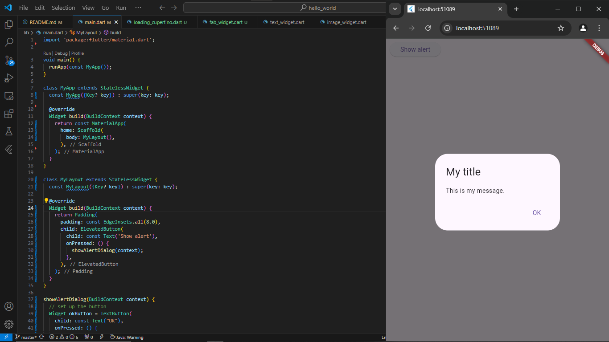

### Input dan Selection Widget
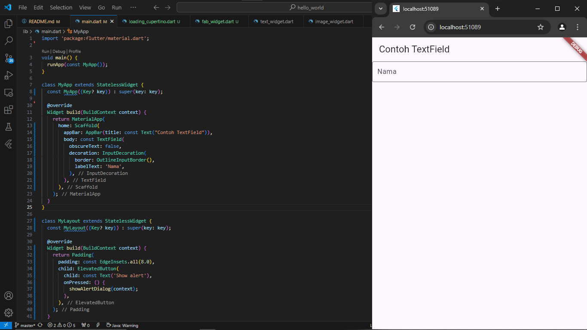

### Date and Time Pickers
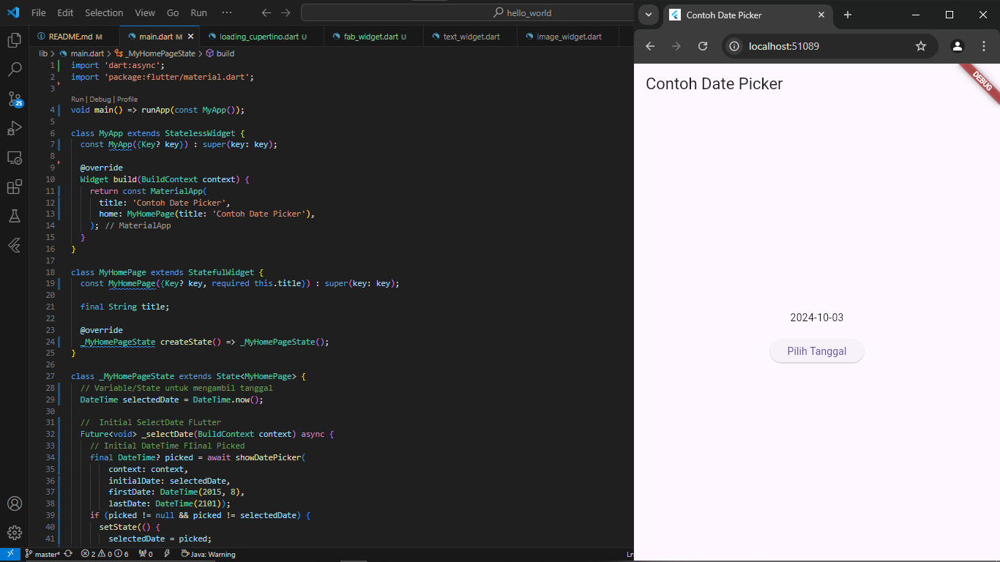